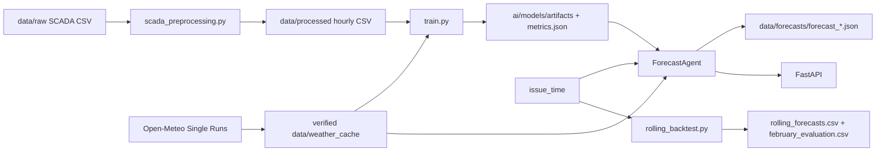

# Leakage-Safe Wind-Turbine Power Forecasting

**Project name:** Leakage-Safe Wind-Turbine Power Forecasting

An agentic, reproducible baseline for forecasting hourly normalized active power for two wind turbines 24–48 hours ahead. The repository is designed for the February 2026 hackathon test period and keeps forecast issue time, weather run time, valid time, and lead time explicit so that historical forecasts can be audited for leakage.

## 1. Problem statement

The system forecasts the next 24–48 hourly values of normalized wind-turbine power. It is intended for operators and hackathon judges who need a reproducible forecast pipeline rather than a notebook-only model. Historical SCADA data ends on 31 January 2026; February 2026 is treated as a future test period.

## 2. Solution overview

The pipeline preprocesses station-local SCADA exports, downloads or reads verified archived Open-Meteo forecast runs, trains deterministic scikit-learn regressors, and runs a state-machine forecast agent. The official rolling simulation issues a new forecast at local midnight each day from 31 January through 28 February 2026. Overlapping forecasts are retained and a documented, issue-time-safe selection rule creates one evaluation row per turbine and valid hour.

This implementation is intentionally deterministic. It does not use an LLM: “agentic” refers to the explicit workflow/orchestration and validation states in `ForecastAgent`.

## 3. What is implemented

- Hourly preprocessing for both raw turbine CSV files, including multilingual column handling, duplicate resolution, minimum source-row checks, and clipping normalized power to `[0, 1]`.
- Chronological measured-weather baseline using ExtraTrees, HistGradientBoosting, and a binned wind-power curve.
- Leakage-safe archived-weather training using Open-Meteo Single Runs and the 24/48-hour lead groups available in the verified cache.
- Per-turbine joblib artifacts, model metadata, input hashes, and machine-readable metrics.
- Forecast agent with weather-run safety checks, feature validation, output clipping, immutable versioned JSON outputs, and explicit failure states.
- FastAPI endpoints for health, one forecast, latest forecast, and metrics.
- React/Vite dashboard that sends real requests to the FastAPI forecast endpoint.
- Official February 2026 rolling backtest with 29 issue times, preserved per-issue runs, and a one-row-per-valid-hour evaluation file.
- Unit and integration tests plus CI configuration.

## 4. Agentic workflow

For one forecast request, `ForecastAgent` executes these states:

`FETCH_WEATHER → VALIDATE_INPUT → BUILD_FEATURES → RUN_MODEL → VALIDATE_OUTPUT → SAVE_RESULT → COMPLETE`.

The agent fetches both turbines’ weather, verifies the selected run and provenance, checks that the model was available at issue time, builds UTC cyclical and weather features, clips predictions to `[0, 1]`, validates every row, and writes a versioned artifact. Failures transition to `FAILED` with a structured error code.

## 5. Architecture



## 6. Dataset and time semantics

There are three deliberately separate data layers:

1. **Actual historical SCADA data.** `data/raw/tribune_1.csv` and `tribune_2.csv` contain measured power and weather observations. Their timestamps are naive station-local time and are interpreted as `Asia/Almaty`. Preprocessing produces hourly files in `data/processed/`. Targets and January validation use only data through 2026-01-31; February actual power is excluded.
2. **Archived weather forecasts.** `data/weather_cache/` stores Open-Meteo ECMWF IFS Single Runs with explicit `weather_run_time`, `issue_time`/availability metadata, `valid_time`, coordinates, units, and checksums. These are forecasts, not observations that were known after the fact.
3. **February test predictions.** `data/forecasts/` contains model outputs only. February actual power is not read by the rolling backtest, so no February accuracy claim is made.

Configured turbine coordinates are stored in `data/turbines.json` and are used for weather retrieval.

## 7. Data preprocessing

Run:

```powershell
python -m ai.models.scada_preprocessing
```

The command reads the raw CSVs, normalizes headers, parses station-local timestamps, removes targets on or after 2026-02-01, aggregates to hourly rows, keeps an hour only when at least three valid source records are available, and adds:

- `hour_sin`, `hour_cos`
- `day_of_year_sin`, `day_of_year_cos`

No long-gap forward fill or interpolation is performed. The generated data-quality report is `docs/data-analysis.md`.

## 8. Weather source and the exact no-leakage rule

Weather comes from the public Open-Meteo Single Runs endpoint (`single-runs-api.open-meteo.com/v1/forecast`) using the `ecmwf_ifs` model and hourly fields `wind_speed_80m`, `wind_speed_100m`, `wind_speed_120m`, `wind_direction_100m`, `temperature_2m`, and `surface_pressure`. The downloader records explicit historical runs in `data/weather_cache/`; it does not silently replace unavailable forecasts with measured weather.

The exact safety rule applied by training and inference is:

```text
weather_run_time + publication_safety_delay (at least 6 hours)
    <= issue_time < valid_time
```

The selected model artifact must also have `available_at <= issue_time`. A cached run is therefore usable only when it could have been published by the simulated issue time, and the weather value must forecast (not observe) the valid hour. A single older-cycle fallback is allowed by the client when the preferred cycle is not safely available. No February actual power or future measured weather is used by `rolling_backtest.py`.

## 9. Machine-learning approach

All models use scikit-learn and deterministic seed `42`.

### Archived-weather production candidates

- `ExtraTreesRegressor(n_estimators=128, min_samples_leaf=2, random_state=42, n_jobs=1)`
- `HistGradientBoostingRegressor(max_iter=300, l2_regularization=0.1, early_stopping=False, random_state=42)`

Archived-weather features are the six Open-Meteo forecast fields above plus the four cyclical time features. Training uses archived rows whose forecast leads are approximately 24 and 48 hours (±3 hours), with a chronological split. Each turbine gets its own artifact. Predictions are clipped to `[0, 1]`.

### Measured-SCADA-weather diagnostic baseline

The baseline uses measured `mean_wind_speed`, measured `mean_ambient_temperature`, and the four cyclical features. It is useful as a data/pipeline diagnostic, but is optimistic for deployment because measured future weather would not be available at a real issue time. It is not the production weather-input model.

## 10. Validation and model selection

The primary chronological training/validation boundary is:

- training: usable data before 2026-01-01;
- validation: 2026-01-01 through 2026-01-31;
- February 2026: held-out prediction period, not a training or accuracy period.

For production artifact availability, model selection uses only January targets that were already available by the first February issue (`2026-01-30T19:00:00Z`, midnight 31 January in `Asia/Almaty`). Later January rows are retained for reporting but cannot influence the first rolling forecast. Candidate models are compared primarily by validation MAE; RMSE and R² are also reported.

## 11. Metrics actually produced

The archived-weather metrics are stored in `ai/models/artifacts/metrics.json`. The current checked-in metrics report the following full January validation values:

| Turbine | Selected archived model | MAE | RMSE | R² |
|---|---|---:|---:|---:|
| 1 | HistGradientBoosting | 0.19819 | 0.27484 | 0.33606 |
| 2 | HistGradientBoosting | 0.22135 | 0.28714 | 0.27664 |

The measured-SCADA-weather diagnostic metrics are in `ai/models/artifacts/validation_metrics.json`:

| Turbine | Selected baseline | MAE | RMSE | R² |
|---|---|---:|---:|---:|
| 1 | ExtraTrees | 0.02236 | 0.04708 | 0.98052 |
| 2 | ExtraTrees | 0.02448 | 0.06049 | 0.96790 |

The large difference is expected: the baseline sees measured weather for the validation hour, while the archived model sees only weather forecasts that were available before that hour. The rolling report intentionally contains no February accuracy metric.

## 12. Project structure

```text
ai/models/scada_preprocessing.py       SCADA cleaning and hourly aggregation
ai/models/baseline_forecasting.py     measured-weather diagnostic training
ai/models/train.py                    archived-weather training
ai/models/artifacts/                  joblib models and JSON metrics
ai/services/weather_client.py         Open-Meteo client, cache and safety checks
ai/services/archive_download.py       historical forecast-run downloader
ai/services/forecast_agent.py         deterministic forecast state machine
ai/services/rolling_backtest.py       official February issue-time simulation
ai/services/replay.py                 legacy daily replay utility
backend/app/                          FastAPI application and routes
frontend/                             React/Vite forecast dashboard
data/raw/                             source SCADA exports
data/processed/                       hourly SCADA data
data/weather_cache/                   verified archived forecast runs (git-ignored)
data/forecasts/                       forecast and backtest outputs
docs/backtesting.md                   detailed rolling policy
docs/data-analysis.md                 preprocessing/data-quality report
tests/                                unit and integration tests
```

## 13. Installation

Use Python 3.14 (the CI workflow uses this version), create a virtual environment, and install the pinned dependencies:

```powershell
python -m venv .venv
.\.venv\Scripts\Activate.ps1
python -m pip install --upgrade pip
python -m pip install -r requirements.txt
python -m pip check
```

The repository has no `pyproject.toml`, Python package build, or Docker image. The frontend is a separate npm/Vite application under `frontend/`.

## 14. Environment variables

No environment variable is required for deterministic training, backtesting, or the FastAPI service. The frontend supports optional `VITE_API_BASE_URL`: leave it empty for the Vite `/api` proxy to `http://127.0.0.1:8000`, or set it to a separately hosted API origin. `.env.example` also contains blank `OPENAI_API_KEY` and `NVIDIA_API_KEY` placeholders for future integrations; the current backend does not require an LLM and does not read these keys. Never commit secrets or a populated `.env` file.

## 15. Train the models

Prepare processed data if needed, then train the archived-weather production models from a populated cache:

```powershell
python -m ai.models.scada_preprocessing
python -m ai.models.train
```

To compare the measured-weather diagnostic baseline separately:

```powershell
python -m ai.models.baseline_forecasting
```

`train.py` writes archived artifacts and metrics under `ai/models/artifacts/`. If the archive is insufficient, the code reports the limitation and retains the existing baseline path rather than silently substituting observations.

## 16. Start the API

```powershell
python -m uvicorn backend.app.main:app --host 127.0.0.1 --port 8000
```

Open `http://127.0.0.1:8000/docs` for the generated Swagger UI. Available routes are `GET /health`, `POST /api/forecast/run`, `GET /api/forecast/latest`, and `GET /api/metrics`.

## 17. Run one forecast

With the verified cache and artifacts present, submit an issue time that has a safe archived run. The first official issue is a reproducible example:

```powershell
$body = @{
  issue_time = "2026-01-30T19:00:00Z"
  horizon_hours = 24
} | ConvertTo-Json

Invoke-RestMethod `
  -Uri http://127.0.0.1:8000/api/forecast/run `
  -Method Post `
  -ContentType "application/json" `
  -Body $body
```

`issue_time` must be timezone-aware and `horizon_hours` must be an integer from 24 to 48. The response contains per-turbine hourly predictions and provenance. The same flow can be called directly from Python through `ForecastAgent`.

## 18. Output format

Per-run JSON files in `data/forecasts/` contain metadata and rows with:

```text
issue_time
weather_run_time
valid_time
turbine_id
lead_hour
predicted_normalized_power
model_version
weather_input_hash
```

The rolling export `data/forecasts/rolling_forecasts.csv` preserves every run and every row. `data/forecasts/february_evaluation.csv` contains one selected prediction per `(turbine_id, valid_time)` and includes the chosen issue time, weather run time, lead hour, model version, and weather hash. All predictions are finite and in `[0, 1]`.

## 19. Reproduce the February 2026 rolling backtest

The official simulation starts at 31 January local midnight and issues daily forecasts through 28 February. It uses 29 issue times, a 48-hour horizon, and only cached forecast runs safe at each issue time.

If the cache is not already populated, download the explicit historical runs (this uses the public Open-Meteo endpoint):

```powershell
python -m ai.services.archive_download `
  --start 2025-11-30T00:00:00Z `
  --end 2026-02-27T00:00:00Z `
  --step-hours 6 `
  --workers 2
```

Then run offline for a reproducible audit:

```powershell
python -m ai.services.rolling_backtest --cache-only
```

Outputs:

- `data/forecasts/rolling/` — one immutable JSON file per issue;
- `data/forecasts/rolling_forecasts.csv` — all 2,784 forecast rows (29 × 2 × 48);
- `data/forecasts/february_evaluation.csv` — 1,344 selected rows (672 hours per turbine);
- `data/forecasts/rolling_report.json` — timestamp, count, lead-time, and leakage checks.

For the official policy and the deterministic overlap rule (“most recent eligible issue with 24 ≤ lead hour ≤ 48”), see [docs/backtesting.md](docs/backtesting.md). `ai.services.replay` remains as a legacy 23:00 diagnostic utility; it is not the official rolling simulation.

## 20. How a judge can verify the result

1. Run `python -m pip check` and the test command below.
2. Inspect `ai/models/artifacts/metrics.json` and confirm the selected model, feature list, `available_at`, and January date boundaries.
3. Run the backtest with `--cache-only` and inspect `rolling_report.json` for `COMPLETE`, 29 issues, 2,784 forecast rows, and 1,344 evaluation rows.
4. Check that every rolling row satisfies `weather_run_time + 6 hours <= issue_time < valid_time`, `available_at <= issue_time`, and `0 <= predicted_normalized_power <= 1`.
5. Confirm that February actual power is absent from the rolling code and that `february_evaluation.csv` is prediction-only.
6. Load an artifact in a fresh process:

```powershell
python -c "import joblib; m=joblib.load('ai/models/artifacts/turbine_1_archived.joblib'); print(type(m).__name__)"
```

## 21. Tests

Run the same discovery command used by CI:

```powershell
python -m unittest discover -s tests -v
```

The suite covers preprocessing, model training, artifact loading, weather-run safety, API behavior, forecast-agent validation, and rolling-backtest leakage rules. CI is defined in `.github/workflows/tests.yml` and runs dependency installation, `pip check`, and the test suite on pushes and pull requests.

## 22. Frontend and deployment

The repository includes a React 19/Vite dashboard in `frontend/`. Start the API first, then run:

```powershell
cd frontend
npm install
npm run dev
```

Open `http://127.0.0.1:5173`. Vite proxies `/api` and `/health` to the local FastAPI service. For a production-style local build:

```powershell
npm run build
npm run preview
```

The repository has no deployed URL. Swagger UI remains available at `http://127.0.0.1:8000/docs`.

## 23. Known limitations

- The official test month has no actual February power in the repository, so February forecast accuracy cannot be calculated here.
- Open-Meteo availability and network access are external dependencies; `--cache-only` intentionally fails when a required run is missing instead of hiding the gap.
- Archived-weather training currently uses the available operational Single Runs cache and approximate 24/48-hour lead groups; coverage and model quality depend on that cache.
- The SCADA timestamps are station-local and the repository assumes `Asia/Almaty`; a different station timezone would require configuration and reprocessing.
- The model is a baseline with limited feature engineering and no uncertainty intervals, probabilistic forecast, online retraining, or drift monitoring.
- Authentication, persistence database, and production deployment are not implemented.
- `ai.services.replay` uses an older daily schedule and should not be confused with the official rolling backtest.

## 24. Potential future improvements

- Add more archived forecast cycles and additional lead-specific models.
- Add calibrated uncertainty intervals and operational alerting.
- Add forecast-vs-actual scoring when February observations become available.
- Extend the dashboard with historical charts, persistent run storage, authentication, monitoring, and scheduled retraining.
- Evaluate additional scikit-learn models and turbine/site-specific feature engineering without relaxing the issue-time rule.

## 25. Team roles

Team-member names and role assignments are not recorded in the repository, so none are invented here. The code is organized so that preprocessing/data engineering, weather provenance, ML training, agent/API integration, and validation/documentation can be assigned as presentation roles.

## 26. References in this repository

- [Backtesting policy](docs/backtesting.md)
- [Data analysis and preprocessing report](docs/data-analysis.md)
- [Project audit](docs/project-audit.md)
- [Data notes](data/README.md)
- [Backend API notes](backend/README.md)
- [Frontend status](frontend/README.md)

No deployed-version link is available in the current repository.
